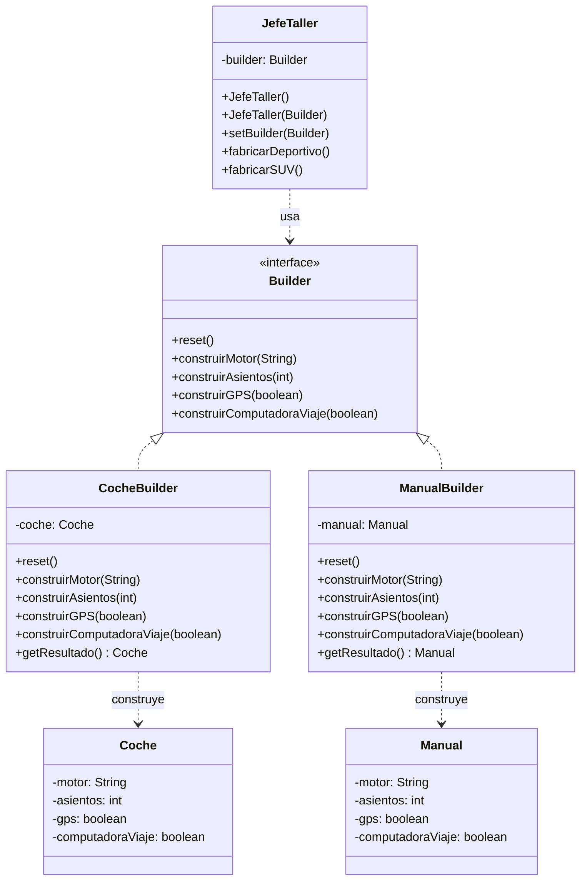

# Builder (Constructor)

## ¿Qué es Builder?

Builder es un patrón de diseño **creacional** que separa la **construcción** de un objeto complejo de su **representación final**. Permite construir el objeto paso a paso, usando exactamente el mismo proceso de construcción para producir **representaciones distintas** del mismo objeto.

En lugar de tener un constructor gigante con decenas de parámetros (muchos opcionales), o una explosión de subclases para cada combinación posible, Builder concentra la lógica de armado en clases separadas que saben cómo construir el objeto pieza por pieza.

A diferencia de los otros patrones creacionales, Builder no se enfoca en *qué* se crea, sino en *cómo* se crea: el énfasis está en el proceso de construcción.

---

## Estructura general


**Qué representa cada número de la figura:**

1. **La interfaz Constructora (Builder)** declara los pasos de construcción que comparten todos los tipos de constructores concretos. No dice *cómo* se ejecuta cada paso, solo *qué* pasos existen.
2. **Los Constructores Concretos (ConcreteBuilder)** ofrecen distintas implementaciones de esos pasos. Cada uno sabe cómo construir un producto específico, y pueden producir productos que no comparten una interfaz o jerarquía común entre sí.
3. **Los Productos (Product)** son los objetos resultantes de la construcción. Los productos generados por distintos constructores no tienen por qué pertenecer a la misma jerarquía de clases.
4. **La clase Directora (Director)** es opcional. Define el **orden** en el que se ejecutan los pasos de construcción, permitiendo encapsular y reutilizar configuraciones específicas del proceso.
5. **El Cliente** asocia un constructor concreto con la directora (normalmente una sola vez, a través del constructor de la directora) y deja que sea ella quien orqueste el proceso paso a paso.

---

## El problema

Imagina que eres el dueño de una **concesionaria de autos**. Un cliente llega y te pide un **deportivo**. Necesita dos cosas:

1. El **auto físico**, para poder manejarlo.
2. El **manual de usuario**, para saber cómo usar el GPS y la computadora de viaje.

Modelar esto con las herramientas tradicionales de Java genera dos problemas:

**Problema 1: El constructor telescópico.**
Si intentas crear un auto con un solo constructor, tienes que pasarle todos los datos de golpe:

```java
// Esto es lo que queremos EVITAR:
new Coche("V8 Biturbo", 2, true, true);
// ¿Qué significa cada true? ¿El primer true es GPS o computadora? Nadie lo sabe sin ir a la firma.
```

Con muchos atributos, la llamada se vuelve ilegible y es fácil equivocarse en el orden de dos `true` consecutivos.

**Problema 2: La explosión de subclases.**
Si intentas solucionarlo creando subclases para cada combinación posible, terminas con un desastre:

- `CocheConGPS`
- `CocheConGPSYComputadora`
- `CocheConGPSYComputadoraYTechoSolar`
- ... y así hasta el infinito.

Cada nueva característica duplica el número de clases. Peor aún: ahora necesitas hacer lo mismo para el **manual**, que tiene las mismas características que el auto. Duplicar toda esa lógica es un mantenimiento infernal.

---

## La solución

Se extrae el código de construcción de la clase del producto y se mueve a objetos independientes llamados **constructores** (builders). La construcción se organiza en una serie de pasos (`construirMotor()`, `construirAsientos()`, `construirGPS()`...).

La clave está en que **un mismo proceso de construcción** puede producir productos distintos si se le asigna un constructor diferente:

- El **Jefe de Taller (Director)** tiene una **receta** para armar un deportivo: motor, luego asientos, luego GPS, luego computadora de viaje. No sabe si está armando un auto o un manual, solo sabe el *orden* de los pasos.
- El **Mecánico (CocheBuilder)** recibe esas órdenes y **físicamente** instala cada pieza en el objeto `Coche`.
- El **Redactor Técnico (ManualBuilder)** recibe las **mismas** órdenes, pero en lugar de atornillar nada, **escribe cada especificación** en el objeto `Manual`.

Al final del proceso:

- Si el Jefe trabajó con el Mecánico, el cliente recibe un **Coche físico**.
- Si el Jefe trabajó con el Redactor, el cliente recibe un **Manual impreso**.

Mismo proceso, productos completamente distintos, sin duplicar lógica.

---

## Estructura de la solución



---

## Código para probar

### Los productos: lo que sale del taller

```java
// Coche.java
public class Coche {
    private String motor;
    private int asientos;
    private boolean gps;
    private boolean computadoraViaje;

    public void setMotor(String motor) { this.motor = motor; }
    public void setAsientos(int asientos) { this.asientos = asientos; }
    public void setGps(boolean gps) { this.gps = gps; }
    public void setComputadoraViaje(boolean computadoraViaje) { this.computadoraViaje = computadoraViaje; }

    @Override
    public String toString() {
        return "Coche [Motor=" + motor + ", Asientos=" + asientos
                + ", GPS=" + gps + ", Computadora=" + computadoraViaje + "]";
    }
}
```

```java
// Manual.java
public class Manual {
    private String motor;
    private int asientos;
    private boolean gps;
    private boolean computadoraViaje;

    public void setMotor(String motor) { this.motor = motor; }
    public void setAsientos(int asientos) { this.asientos = asientos; }
    public void setGps(boolean gps) { this.gps = gps; }
    public void setComputadoraViaje(boolean computadoraViaje) { this.computadoraViaje = computadoraViaje; }

    @Override
    public String toString() {
        return "Manual [Instrucciones para Motor=" + motor + ", Asientos=" + asientos
                + ", GPS=" + gps + ", Computadora=" + computadoraViaje + "]";
    }
}
```

### El contrato del taller

```java
// Builder.java
public interface Builder {
    void reset();
    void construirMotor(String motor);
    void construirAsientos(int asientos);
    void construirGPS(boolean gps);
    void construirComputadoraViaje(boolean computadora);
}
```

### Los constructores concretos: el Mecánico y el Redactor

```java
// CocheBuilder.java
// El Mecanico instala fisicamente las piezas en un objeto Coche.
public class CocheBuilder implements Builder {
    private Coche coche;

    public CocheBuilder() {
        this.coche = new Coche();
    }

    @Override
    public void reset() { this.coche = new Coche(); }

    @Override
    public void construirMotor(String motor) { this.coche.setMotor(motor); }

    @Override
    public void construirAsientos(int asientos) { this.coche.setAsientos(asientos); }

    @Override
    public void construirGPS(boolean gps) { this.coche.setGps(gps); }

    @Override
    public void construirComputadoraViaje(boolean computadora) {
        this.coche.setComputadoraViaje(computadora);
    }

    public Coche getResultado() { return this.coche; }
}
```

```java
// ManualBuilder.java
// El Redactor escribe las mismas especificaciones, pero en un objeto Manual.
public class ManualBuilder implements Builder {
    private Manual manual;

    public ManualBuilder() {
        this.manual = new Manual();
    }

    @Override
    public void reset() { this.manual = new Manual(); }

    @Override
    public void construirMotor(String motor) { this.manual.setMotor(motor); }

    @Override
    public void construirAsientos(int asientos) { this.manual.setAsientos(asientos); }

    @Override
    public void construirGPS(boolean gps) { this.manual.setGps(gps); }

    @Override
    public void construirComputadoraViaje(boolean computadora) {
        this.manual.setComputadoraViaje(computadora);
    }

    public Manual getResultado() { return this.manual; }
}
```

### El Director: el Jefe de Taller

```java
// JefeTaller.java
public class JefeTaller {
    private Builder builder;

    public JefeTaller() {}

    public JefeTaller(Builder builder) {
        this.builder = builder;
    }

    public void setBuilder(Builder builder) {
        this.builder = builder;
    }

    // Receta para armar un deportivo
    public void fabricarDeportivo() {
        builder.reset();
        builder.construirMotor("V8 Biturbo");
        builder.construirAsientos(2);
        builder.construirGPS(true);
        builder.construirComputadoraViaje(true);
    }

    // Receta para armar un SUV familiar
    public void fabricarSUV() {
        builder.reset();
        builder.construirMotor("V6 Hibrido");
        builder.construirAsientos(7);
        builder.construirGPS(true);
        builder.construirComputadoraViaje(false);
    }
}
```

### El cliente: el concesionario

```java
// App.java
public class App {
    public static void main(String[] args) {
        JefeTaller jefe = new JefeTaller();

        // 1. Fabricar el auto fisico
        CocheBuilder mecanico = new CocheBuilder();
        jefe.setBuilder(mecanico);
        jefe.fabricarDeportivo();
        Coche miCoche = mecanico.getResultado();
        System.out.println("Auto listo para el cliente: " + miCoche);

        // 2. Fabricar el manual del mismo auto
        //    Misma receta, mismo jefe, trabajador distinto.
        ManualBuilder redactor = new ManualBuilder();
        jefe.setBuilder(redactor);
        jefe.fabricarDeportivo();
        Manual miManual = redactor.getResultado();
        System.out.println("Manual listo para el cliente: " + miManual);
    }
}
```

Salida esperada:

```
Auto listo para el cliente: Coche [Motor=V8 Biturbo, Asientos=2, GPS=true, Computadora=true]
Manual listo para el cliente: Manual [Instrucciones para Motor=V8 Biturbo, Asientos=2, GPS=true, Computadora=true]
```

Nota que el `JefeTaller` ejecutó **la misma receta** (`fabricarDeportivo()`) en ambos casos. La diferencia está en qué trabajador (builder) tenía asignado en cada momento: el resultado es un objeto `Coche` o un objeto `Manual`.

---

## Variante: Builder sin Director (Interfaz Fluida)

En la práctica, muchas veces se omite el `JefeTaller`. Cuando el cliente necesita flexibilidad total y no hay recetas fijas, encadena los métodos del builder directamente (patrón conocido como **fluent interface**). El builder devuelve `this` en cada paso, permitiendo escribir la construcción como una sola frase.

```java
// Computador.java (variante fluida, sin Director)
public class Computador {
    private final String procesador;
    private final int ramGB;
    private final int almacenamientoGB;
    private final String tarjetaGrafica;

    private Computador(ComputadorBuilder builder) {
        this.procesador = builder.procesador;
        this.ramGB = builder.ramGB;
        this.almacenamientoGB = builder.almacenamientoGB;
        this.tarjetaGrafica = builder.tarjetaGrafica;
    }

    public static class ComputadorBuilder {
        private String procesador;
        private int ramGB;
        private int almacenamientoGB;
        private String tarjetaGrafica;

        public ComputadorBuilder conProcesador(String p) { this.procesador = p; return this; }
        public ComputadorBuilder conRAM(int r) { this.ramGB = r; return this; }
        public ComputadorBuilder conAlmacenamiento(int a) { this.almacenamientoGB = a; return this; }
        public ComputadorBuilder conTarjetaGrafica(String t) { this.tarjetaGrafica = t; return this; }

        public Computador construir() { return new Computador(this); }
    }
}
```

Uso:

```java
Computador pc = new Computador.ComputadorBuilder()
        .conProcesador("Intel i7")
        .conRAM(16)
        .conAlmacenamiento(512)
        .conTarjetaGrafica("RTX 4060")
        .construir();
```

**¿Cuándo usar cada variante?**

- **Con Director (Jefe de Taller)**: cuando el orden de construcción es fijo, complejo, o se repite en muchos lugares. El Director encapsula las recetas.
- **Sin Director (fluida)**: cuando el cliente necesita flexibilidad total para armar el objeto en el orden que quiera, y no hay recetas predefinidas.

---

## Cuándo usarlo y cuándo no

**Úsalo cuando:**

- Un objeto tiene muchos parámetros opcionales y quieres evitar constructores telescópicos.
- Necesitas producir **distintas representaciones** de un mismo objeto usando los mismos pasos de construcción (el ejemplo del Coche y el Manual).
- El proceso de construcción implica varios pasos que se benefician de leerse como una secuencia clara.
- Quieres aislar el código de construcción complejo de la lógica de negocio del producto (Principio de Responsabilidad Única).

**Evítalo cuando:**

- El objeto tiene dos o tres atributos obligatorios y ninguno opcional: un constructor normal es más simple y no necesita esta maquinaria adicional.
- El proceso de construcción no varía ni se reutiliza: crear múltiples clases de builder para un único caso es sobre-ingeniería.
- El orden de construcción no importa y el objeto es simple: una fluent interface es suficiente sin necesidad de interfaz `Builder` ni Director.

---

## Resumen

| Aspecto | Builder |
|---|---|
| **Categoría** | Creacional |
| **Problema que resuelve** | Construcción de objetos complejos con muchos parámetros opcionales, o producción de distintas representaciones del mismo objeto |
| **Mecanismo típico en Java** | Interfaz `Builder` con pasos, constructores concretos por producto, `Director` opcional para encapsular recetas |
| **Ventaja principal** | Reutiliza el mismo proceso de construcción para producir productos distintos, y separa la construcción de la representación |
| **Desventaja principal** | Aumenta el número de clases del sistema |
| **Patrón relacionado** | **Abstract Factory** crea familias de objetos de una sola vez; **Builder** construye un objeto paso a paso y permite extraer el resultado al final |