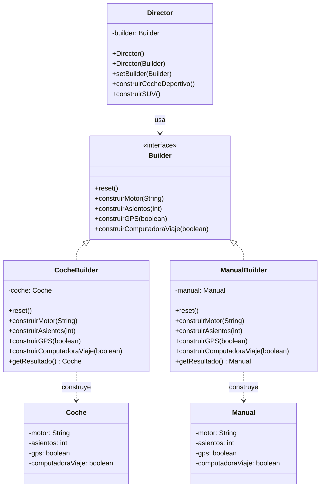

# Builder (Constructor)

## ¿Qué es Builder?

Builder es un patrón de diseño **creacional** cuyo propósito principal es **separar la construcción de un objeto complejo de su representación**, de modo que el mismo proceso de construcción pueda dar lugar a diferentes representaciones.

En lugar de requerir una instanciación monolítica mediante constructores saturados de parámetros, este patrón descompone el proceso de inicialización en una secuencia controlada de pasos de configuración. Esto permite construir objetos de manera incremental y flexible, garantizando un bajo acoplamiento entre la lógica de ensamblaje y la estructura interna del producto resultante.

El patrón se enfoca en el *algoritmo de construcción paso a paso*, desacoplando la definición de los pasos respecto a los objetos concretos que se generan al finalizar dicho proceso.

---

## Estructura general


**Descripción de los componentes de la arquitectura:**

1. **La interfaz Builder (el contrato abstracto):** Declara los métodos de configuración compartidos por todos los constructores concretos. Define *qué* pasos forman parte del proceso de construcción, sin condicionar la implementación interna.
2. **Los Constructores Concretos (*Concrete Builders*):** Implementan los métodos de la interfaz `Builder` para ensamblar las partes específicas de un producto determinado. Mantienen la referencia al producto en construcción y ofrecen un método específico para recuperarlo.
3. **Los Productos:** Representan los objetos complejos generados como resultado del proceso de construcción. A diferencia de otros patrones creacionales, los productos creados por distintos constructores concretos no necesitan compartir una interfaz o jerarquía común.
4. **El Director (el orquestador):** Componente opcional que define el orden de invocación de los pasos de construcción. Permite encapsular y reutilizar rutinas estandarizadas de ensamblaje para configuraciones específicas.
5. **El Cliente:** Entidad que orquesta el flujo general. Asocia una instancia de un constructor concreto con el Director, desencadena la secuencia de construcción y recupera el producto final directamente desde el constructor concreto.

---

## El problema

Considérese el modelado de un dominio automotriz donde se requiere generar tanto la entidad principal (`Coche`) como su correspondiente documentación técnica (`Manual`). Ambos objetos comparten atributos de configuración equivalentes (tipo de motor, número de asientos, presencia de GPS, computadora de viaje), pero presentan finalidades y estructuras internas totalmente distintas.

Al abordar la construcción de objetos complejos con múltiples atributos opcionales mediante los enfoques tradicionales de la programación orientada a objetos, surgen dos problemas arquitectónicos críticos:

**Problema 1: El antipatrón *Telescoping Constructor* (Constructor Telescópico).**
Intentar cubrir múltiples combinaciones mediante constructores sobrecargados con listas extensas de parámetros produce código rígido y propenso a errores:

```java
// Ejemplo del antipatrón a evitar:
new Coche("V8 Biturbo", 2, true, true);
// La presencia de múltiples literales booleanos consecutivos carece de claridad semántica,
// dificulta la legibilidad e incrementa el riesgo de transposición de argumentos.
```

A medida que el número de atributos crece, el mantenimiento se vuelve inviable y los parámetros posicionales introducen fragilidad en las invocaciones.

**Problema 2: La explosión combinatoria de subclases.**
Si se intentara resolver la variabilidad creando una subclase especializada para cada configuración posible, el diseño derivaría en una jerarquía inmanejable:

- `CocheConGPS`
- `CocheConGPSYComputadora`
- `CocheConGPSYComputadoraYTechoSolar`
- ...

Esta estrategia conduce a una proliferación exponencial de clases y a una duplicación masiva de código si, además, debe replicarse la misma taxonomía para modelar la entidad `Manual`.

---

## La solución

El patrón Builder propone **extraer el algoritmo de construcción fuera de la clase del producto**, delegándolo en clases independientes denominadas **constructores concretos** (*builders*). El proceso de inicialización se divide en una secuencia de pasos modulares (`construirMotor()`, `construirAsientos()`, `construirGPS()`, etc.).

La ventaja fundamental de este enfoque es que **el mismo proceso algorítmico de construcción** permite generar productos totalmente heterogéneos según el constructor concreto utilizado:

- La clase **`Director`** asume el rol de **orquestador**. Conoce y define la secuencia exacta de llamadas requeridas para configurar un perfil específico (por ejemplo, un coche deportivo o un SUV). El Director interactúa exclusivamente a través de la interfaz abstracta `Builder`, manteniendo un completo desacoplamiento respecto a la clase concreta del producto final.
- El constructor concreto **`CocheBuilder`** ejecuta las operaciones de construcción asignando las propiedades a una instancia del objeto `Coche`.
- El constructor concreto **`ManualBuilder`** procesa idénticos datos de configuración, pero registra la información dentro de una instancia de `Manual`.

Como resultado:

- Si el `Director` opera con `CocheBuilder`, el cliente obtiene una instancia del modelo físico `Coche`.
- Si el `Director` opera con `ManualBuilder`, el cliente obtiene una instancia de la documentación técnica `Manual`.

El sistema logra la reutilización integral del algoritmo de ensamblaje, evitando duplicación de lógica y manteniendo un bajo acoplamiento entre los componentes.

---

## Estructura de la solución



---

## Código para probar

### Clases de producto: Coche y Manual

```java
// Coche.java
public class Coche {
    private String motor;
    private int asientos;
    private boolean gps;
    private boolean computadoraViaje;

    public void setMotor(String motor) { this.motor = motor; }
    public void setAsientos(int asientos) { this.asientos = asientos; }
    public void setGps(boolean gps) { this.gps = gps; }
    public void setComputadoraViaje(boolean computadoraViaje) { this.computadoraViaje = computadoraViaje; }

    @Override
    public String toString() {
        return "Coche [Motor=" + motor + ", Asientos=" + asientos + ", GPS=" + gps + ", Computadora=" + computadoraViaje + "]";
    }
}
```

```java
// Manual.java
public class Manual {
    private String motor;
    private int asientos;
    private boolean gps;
    private boolean computadoraViaje;

    public void setMotor(String motor) { this.motor = motor; }
    public void setAsientos(int asientos) { this.asientos = asientos; }
    public void setGps(boolean gps) { this.gps = gps; }
    public void setComputadoraViaje(boolean computadoraViaje) { this.computadoraViaje = computadoraViaje; }

    @Override
    public String toString() {
        return "Manual [Instrucciones para Motor=" + motor + ", Asientos=" + asientos + ", GPS=" + gps + ", Computadora=" + computadoraViaje + "]";
    }
}
```

### Interfaz Builder

```java
// Builder.java
public interface Builder {
    void reset();
    void construirMotor(String motor);
    void construirAsientos(int asientos);
    void construirGPS(boolean gps);
    void construirComputadoraViaje(boolean computadora);
}
```

### Constructores concretos: CocheBuilder y ManualBuilder

```java
// CocheBuilder.java
public class CocheBuilder implements Builder {
    private Coche coche;

    public CocheBuilder() {
        this.coche = new Coche();
    }

    @Override
    public void reset() { this.coche = new Coche(); }

    @Override
    public void construirMotor(String motor) { this.coche.setMotor(motor); }

    @Override
    public void construirAsientos(int asientos) { this.coche.setAsientos(asientos); }

    @Override
    public void construirGPS(boolean gps) { this.coche.setGps(gps); }

    @Override
    public void construirComputadoraViaje(boolean computadora) { this.coche.setComputadoraViaje(computadora); }

    public Coche getResultado() { return this.coche; }
}
```

```java
// ManualBuilder.java
public class ManualBuilder implements Builder {
    private Manual manual;

    public ManualBuilder() {
        this.manual = new Manual();
    }

    @Override
    public void reset() { this.manual = new Manual(); }

    @Override
    public void construirMotor(String motor) { this.manual.setMotor(motor); }

    @Override
    public void construirAsientos(int asientos) { this.manual.setAsientos(asientos); }

    @Override
    public void construirGPS(boolean gps) { this.manual.setGps(gps); }

    @Override
    public void construirComputadoraViaje(boolean computadora) { this.manual.setComputadoraViaje(computadora); }

    public Manual getResultado() { return this.manual; }
}
```

### Clase Director

```java
// Director.java
public class Director {
    private Builder builder;

    public Director() {
    }

    public Director(Builder builder) {
        this.builder = builder;
    }

    public void setBuilder(Builder builder) {
        this.builder = builder;
    }
    // Define el orden para un coche deportivo
    public void construirCocheDeportivo() {
        builder.reset();
        builder.construirMotor("V8 Biturbo");
        builder.construirAsientos(2);
        builder.construirGPS(true);
        builder.construirComputadoraViaje(true);
    }

    // Define el orden para un coche familiar (SUV)
    public void construirSUV() {
        builder.reset();
        builder.construirMotor("V6 Híbrido");
        builder.construirAsientos(7);
        builder.construirGPS(true);
        builder.construirComputadoraViaje(false);
    }
}
```

### Cliente: App.java

```java
// App.java
public class App {
    public static void main(String[] args) {
        Director director = new Director();

        // 1. Construir un Coche Deportivo
        CocheBuilder cocheBuilder = new CocheBuilder();
        director.setBuilder(cocheBuilder);
        director.construirCocheDeportivo();
        Coche coche = cocheBuilder.getResultado();
        System.out.println("Coche construido: " + coche);

        // 2. Construir el Manual para ese mismo Coche Deportivo
        ManualBuilder manualBuilder = new ManualBuilder();
        director.setBuilder(manualBuilder); // ¡Cambiamos el builder!
        director.construirCocheDeportivo(); // Usamos los mismos pasos
        Manual manual = manualBuilder.getResultado();
        System.out.println("Manual construido: " + manual);
    }
}
```

Salida esperada:

```
Coche construido: Coche [Motor=V8 Biturbo, Asientos=2, GPS=true, Computadora=true]
Manual construido: Manual [Instrucciones para Motor=V8 Biturbo, Asientos=2, GPS=true, Computadora=true]
```

Como se evidencia en la ejecución, la clase `Director` ejecuta idéntica secuencia de configuración (`construirCocheDeportivo()`) en ambas etapas. La variabilidad del resultado reside exclusivamente en la implementación concreta de `Builder` suministrada (`CocheBuilder` o `ManualBuilder`), instanciando objetos heterogéneos (`Coche` o `Manual`) a partir de un proceso de ensamblaje común.

---

## Variante: Builder sin Director (Interfaz Fluida)

En diversas arquitecturas de software, la incorporación de un `Director` no es indispensable. Cuando no existen secuencias de ensamblaje predeterminadas y el cliente requiere flexibilidad para configurar atributos de forma arbitraria, se implementa frecuentemente una **interfaz fluida** (*Fluent Interface* o *Method Chaining*). En este diseño, cada método mutador del builder retorna la propia instancia (`return this`), facilitando el encadenamiento de llamadas sucesivas hasta invocar el método de instanciación final.

```java
// Computador.java (variante fluida, sin Director)
public class Computador {
    private final String procesador;
    private final int ramGB;
    private final int almacenamientoGB;
    private final String tarjetaGrafica;

    private Computador(ComputadorBuilder builder) {
        this.procesador = builder.procesador;
        this.ramGB = builder.ramGB;
        this.almacenamientoGB = builder.almacenamientoGB;
        this.tarjetaGrafica = builder.tarjetaGrafica;
    }

    public static class ComputadorBuilder {
        private String procesador;
        private int ramGB;
        private int almacenamientoGB;
        private String tarjetaGrafica;

        public ComputadorBuilder conProcesador(String p) { this.procesador = p; return this; }
        public ComputadorBuilder conRAM(int r) { this.ramGB = r; return this; }
        public ComputadorBuilder conAlmacenamiento(int a) { this.almacenamientoGB = a; return this; }
        public ComputadorBuilder conTarjetaGrafica(String t) { this.tarjetaGrafica = t; return this; }

        public Computador construir() { return new Computador(this); }
    }
}
```

Uso:

```java
Computador pc = new Computador.ComputadorBuilder()
        .conProcesador("Intel i7")
        .conRAM(16)
        .conAlmacenamiento(512)
        .conTarjetaGrafica("RTX 4060")
        .construir();
```

**Criterios de elección entre variantes:**

- **Con Director:** Recomendada cuando el orden de ejecución de los pasos es estricto y se requiere reutilizar rutinas estandarizadas de construcción en múltiples puntos del sistema.
- **Sin Director (Interfaz fluida):** Recomendada cuando el cliente necesita libertad para ensamblar el objeto con configuraciones personalizadas y variables, prescindiendo de una secuencia prefijada.

---

## Cuándo usarlo y cuándo no

**Aplicabilidad (Cuándo usarlo):**

- Para mitigar el antipatrón *Telescoping Constructor* cuando un objeto posee un elevado número de atributos, en particular aquellos de carácter opcional.
- Cuando el proceso de construcción debe permitir la instanciación de diferentes representaciones o modelos de un producto a partir de una misma secuencia de pasos (por ejemplo, `Coche` y `Manual`).
- Cuando la instanciación de un objeto requiere una ejecución controlada en múltiples pasos temporales o diferidos.
- Para cumplir el Principio de Responsabilidad Única (*Single Responsibility Principle*), aislando la complejidad del ensamblaje e inicialización de la lógica propia del dominio del producto.

**Contraindicaciones (Cuándo evitarlo):**

- En clases con baja complejidad estructural, con pocos atributos y de naturaleza obligatoria, donde un constructor convencional o un método fábrica (*Factory Method*) resulta más simple y directo.
- Cuando la lógica de construcción es estática y no sufre variaciones entre instancias, evitando la introducción innecesaria de clases e interfaces adicionales.
- En dominios donde la sobrecarga arquitectónica de mantener la jerarquía de constructores no justifique el beneficio de desacoplamiento obtenido.

---

## Resumen

| Dimensión | Patrón Builder |
|---|---|
| **Clasificación** | Creacional |
| **Problema que resuelve** | Construcción de objetos complejos paso a paso; mitigación del antipatrón *Telescoping Constructor*; generación de múltiples representaciones de un producto a partir de un mismo proceso de ensamblaje. |
| **Implementación en Java** | Definición de una interfaz abstracta `Builder`, implementación de constructores concretos que encapsulan el ensamblaje de cada producto, y una clase `Director` (opcional) que orquesta el orden de invocación. |
| **Ventajas** | Permite variar la representación interna de los productos; aísla el código de construcción de la lógica del dominio; promueve el principio de responsabilidad única y mejora la legibilidad. |
| **Desventajas** | Incrementa la complejidad general del diseño al requerir múltiples clases e interfaces auxiliares para la instanciación de los productos. |
| **Patrones relacionados** | **Abstract Factory**: Se enfoca en la creación de familias completas de objetos dependientes en un único paso; **Builder**: Se enfoca en la construcción paso a paso de objetos complejos y entrega el producto final al término del proceso. |