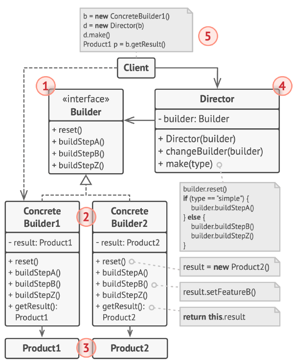
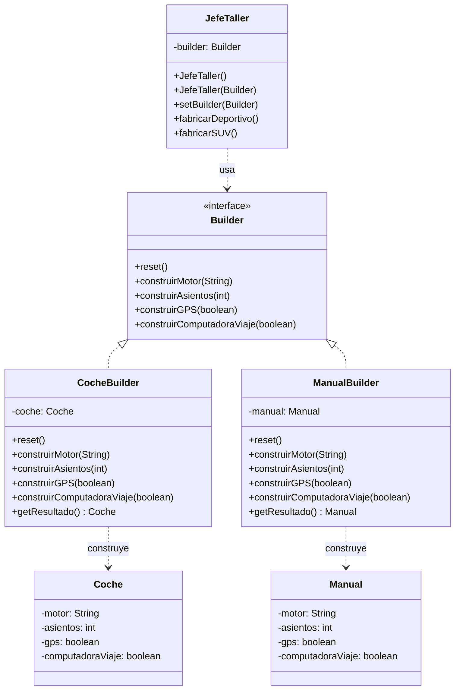

# Builder (Constructor)

## ¿Qué es Builder?

Builder es un patrón de diseño **creacional** (o sea, de los que sirven para crear objetos). Su idea principal es **separar el proceso de armar un objeto del objeto final que resulta**.

Dicho de otra forma: en lugar de crear un objeto de un solo golpe con todos sus datos, lo vas armando **paso a paso**, y puedes usar el mismo proceso para obtener **versiones distintas** del mismo objeto.

Piénsalo como una línea de ensamblaje en una fábrica: los pasos siempre son los mismos, pero según lo que pongas al final de la línea, sale un producto u otro.

Builder no se preocupa por *qué* se crea, sino por *cómo* se crea.

---

## Estructura general



**Qué significa cada número de la imagen:**

1. **La interfaz Builder (el contrato)** es como una lista de pasos que todos los constructores deben saber hacer. No dice *cómo* se hace cada paso, solo *qué* pasos existen.
2. **Los Constructores Concretos (los que trabajan)** son los que realmente ejecutan esos pasos. Cada uno sabe construir un producto diferente, y no tienen por qué parecerse entre sí.
3. **Los Productos** son los objetos que salen al final. Ojo: los productos de distintos constructores pueden ser cosas totalmente distintas, sin ninguna relación entre ellos.
4. **El Director (el jefe)** es opcional. Se encarga de decidir **en qué orden** se ejecutan los pasos. Esto sirve para guardar "recetas" y reutilizarlas.
5. **El Cliente** es quien usa todo esto. Le dice al Director con qué constructor trabajar, y al final le pide el resultado al constructor.

---

## El problema

Imagina que eres el dueño de una **concesionaria de autos**. Llega un cliente y te pide un **deportivo**. Necesita dos cosas:

1. El **auto de verdad**, para manejarlo.
2. El **manual**, para saber cómo funciona el GPS y la computadora.

Si intentas resolver esto de la forma tradicional en Java, te topas con dos problemas:

**Problema 1: El constructor gigante.**
Para crear un auto con un solo constructor, tienes que pasarle todo de golpe:

```java
// Esto es lo que queremos EVITAR:
new Coche("V8 Biturbo", 2, true, true);
// ¿Qué significa cada true? ¿El primero es el GPS o la computadora? Nadie lo sabe a simple vista.
```

Cuando hay muchos datos, la línea se vuelve imposible de leer y es facilísimo equivocarse de orden.

**Problema 2: La explosión de clases.**
Si intentas arreglarlo creando una clase por cada combinación, terminas con un montón de clases sin sentido:

- `CocheConGPS`
- `CocheConGPSYComputadora`
- `CocheConGPSYComputadoraYTechoSolar`
- ... y así sin parar.

Cada característica nueva multiplica las clases. Y lo peor: tienes que hacer lo mismo para el **manual**, que tiene los mismos datos que el auto. Duplicar todo eso es un dolor de cabeza.

---

## La solución

La idea es **sacar el proceso de armado fuera de la clase del producto** y ponerlo en clases aparte llamadas **constructores** (builders). El armado se divide en pasos (`construirMotor()`, `construirAsientos()`, `construirGPS()`...).

Lo bonito es que **el mismo proceso de armado** puede dar productos distintos según quién lo ejecute:

- El **Jefe de Taller (Director)** tiene una **receta** para armar un deportivo: primero el motor, luego los asientos, luego el GPS, luego la computadora. Él no sabe si está armando un auto o un manual, solo sabe el orden de los pasos.
- El **Mecánico (CocheBuilder)** recibe esas órdenes y **de verdad instala** cada pieza dentro del objeto `Coche`.
- El **Redactor (ManualBuilder)** recibe **las mismas órdenes**, pero en lugar de instalar nada, **escribe cada dato** dentro del objeto `Manual`.

Al final:

- Si el Jefe trabajó con el Mecánico, el cliente recibe un **auto físico**.
- Si el Jefe trabajó con el Redactor, el cliente recibe un **manual impreso**.

El mismo proceso, dos productos totalmente distintos, sin repetir lógica.

---

## Estructura de la solución



---

## Código para probar

### Los productos: lo que sale del taller

```java
// Coche.java
public class Coche {
    private String motor;
    private int asientos;
    private boolean gps;
    private boolean computadoraViaje;

    public void setMotor(String motor) { this.motor = motor; }
    public void setAsientos(int asientos) { this.asientos = asientos; }
    public void setGps(boolean gps) { this.gps = gps; }
    public void setComputadoraViaje(boolean computadoraViaje) { this.computadoraViaje = computadoraViaje; }

    @Override
    public String toString() {
        return "Coche [Motor=" + motor + ", Asientos=" + asientos
                + ", GPS=" + gps + ", Computadora=" + computadoraViaje + "]";
    }
}
```

```java
// Manual.java
public class Manual {
    private String motor;
    private int asientos;
    private boolean gps;
    private boolean computadoraViaje;

    public void setMotor(String motor) { this.motor = motor; }
    public void setAsientos(int asientos) { this.asientos = asientos; }
    public void setGps(boolean gps) { this.gps = gps; }
    public void setComputadoraViaje(boolean computadoraViaje) { this.computadoraViaje = computadoraViaje; }

    @Override
    public String toString() {
        return "Manual [Instrucciones para Motor=" + motor + ", Asientos=" + asientos
                + ", GPS=" + gps + ", Computadora=" + computadoraViaje + "]";
    }
}
```

### El contrato del taller

```java
// Builder.java
public interface Builder {
    void reset();
    void construirMotor(String motor);
    void construirAsientos(int asientos);
    void construirGPS(boolean gps);
    void construirComputadoraViaje(boolean computadora);
}
```

### Los constructores concretos: el Mecánico y el Redactor

```java
// CocheBuilder.java
// El Mecanico instala fisicamente las piezas en un objeto Coche.
public class CocheBuilder implements Builder {
    private Coche coche;

    public CocheBuilder() {
        this.coche = new Coche();
    }

    @Override
    public void reset() { this.coche = new Coche(); }

    @Override
    public void construirMotor(String motor) { this.coche.setMotor(motor); }

    @Override
    public void construirAsientos(int asientos) { this.coche.setAsientos(asientos); }

    @Override
    public void construirGPS(boolean gps) { this.coche.setGps(gps); }

    @Override
    public void construirComputadoraViaje(boolean computadora) {
        this.coche.setComputadoraViaje(computadora);
    }

    public Coche getResultado() { return this.coche; }
}
```

```java
// ManualBuilder.java
// El Redactor escribe las mismas especificaciones, pero en un objeto Manual.
public class ManualBuilder implements Builder {
    private Manual manual;

    public ManualBuilder() {
        this.manual = new Manual();
    }

    @Override
    public void reset() { this.manual = new Manual(); }

    @Override
    public void construirMotor(String motor) { this.manual.setMotor(motor); }

    @Override
    public void construirAsientos(int asientos) { this.manual.setAsientos(asientos); }

    @Override
    public void construirGPS(boolean gps) { this.manual.setGps(gps); }

    @Override
    public void construirComputadoraViaje(boolean computadora) {
        this.manual.setComputadoraViaje(computadora);
    }

    public Manual getResultado() { return this.manual; }
}
```

### El Director: el Jefe de Taller

```java
// JefeTaller.java
public class JefeTaller {
    private Builder builder;

    public JefeTaller() {}

    public JefeTaller(Builder builder) {
        this.builder = builder;
    }

    public void setBuilder(Builder builder) {
        this.builder = builder;
    }

    // Receta para armar un deportivo
    public void fabricarDeportivo() {
        builder.reset();
        builder.construirMotor("V8 Biturbo");
        builder.construirAsientos(2);
        builder.construirGPS(true);
        builder.construirComputadoraViaje(true);
    }

    // Receta para armar un SUV familiar
    public void fabricarSUV() {
        builder.reset();
        builder.construirMotor("V6 Hibrido");
        builder.construirAsientos(7);
        builder.construirGPS(true);
        builder.construirComputadoraViaje(false);
    }
}
```

### El cliente: el concesionario

```java
// App.java
public class App {
    public static void main(String[] args) {
        JefeTaller jefe = new JefeTaller();

        // 1. Fabricar el auto fisico
        CocheBuilder mecanico = new CocheBuilder();
        jefe.setBuilder(mecanico);
        jefe.fabricarDeportivo();
        Coche miCoche = mecanico.getResultado();
        System.out.println("Auto listo para el cliente: " + miCoche);

        // 2. Fabricar el manual del mismo auto
        //    Misma receta, mismo jefe, trabajador distinto.
        ManualBuilder redactor = new ManualBuilder();
        jefe.setBuilder(redactor);
        jefe.fabricarDeportivo();
        Manual miManual = redactor.getResultado();
        System.out.println("Manual listo para el cliente: " + miManual);
    }
}
```

Salida esperada:

```
Auto listo para el cliente: Coche [Motor=V8 Biturbo, Asientos=2, GPS=true, Computadora=true]
Manual listo para el cliente: Manual [Instrucciones para Motor=V8 Biturbo, Asientos=2, GPS=true, Computadora=true]
```

Fíjate que el `JefeTaller` usó **la misma receta** (`fabricarDeportivo()`) en los dos casos. Lo único que cambió fue con qué trabajador estaba: por eso el resultado es un `Coche` o un `Manual`.

---

## Variante: Builder sin Director (Interfaz Fluida)

En la práctica, muchas veces no se usa un Jefe (Director). Cuando no hay recetas fijas y el cliente quiere armar las cosas a su manera, va llamando los pasos uno tras otro directamente. A esto se le llama **interfaz fluida**: cada método devuelve el mismo builder para poder encadenar llamadas como si fuera una sola frase.

```java
// Computador.java (variante fluida, sin Director)
public class Computador {
    private final String procesador;
    private final int ramGB;
    private final int almacenamientoGB;
    private final String tarjetaGrafica;

    private Computador(ComputadorBuilder builder) {
        this.procesador = builder.procesador;
        this.ramGB = builder.ramGB;
        this.almacenamientoGB = builder.almacenamientoGB;
        this.tarjetaGrafica = builder.tarjetaGrafica;
    }

    public static class ComputadorBuilder {
        private String procesador;
        private int ramGB;
        private int almacenamientoGB;
        private String tarjetaGrafica;

        public ComputadorBuilder conProcesador(String p) { this.procesador = p; return this; }
        public ComputadorBuilder conRAM(int r) { this.ramGB = r; return this; }
        public ComputadorBuilder conAlmacenamiento(int a) { this.almacenamientoGB = a; return this; }
        public ComputadorBuilder conTarjetaGrafica(String t) { this.tarjetaGrafica = t; return this; }

        public Computador construir() { return new Computador(this); }
    }
}
```

Uso:

```java
Computador pc = new Computador.ComputadorBuilder()
        .conProcesador("Intel i7")
        .conRAM(16)
        .conAlmacenamiento(512)
        .conTarjetaGrafica("RTX 4060")
        .construir();
```

**¿Cuándo usar cada variante?**

- **Con Director (Jefe de Taller)**: cuando el orden de los pasos siempre es el mismo y quieres reutilizar la receta en varios lugares.
- **Sin Director (fluida)**: cuando el cliente necesita armar el objeto a su gusto, sin un orden fijo.

---

## Cuándo usarlo y cuándo no

**Úsalo cuando:**

- Un objeto tiene muchos datos, y la mayoría son opcionales.
- Necesitas crear **versiones distintas** del mismo objeto usando los mismos pasos (como el Coche y el Manual).
- El proceso de armado tiene varios pasos y se entiende mejor si se lee como una secuencia.
- Quieres que la lógica de armado esté separada de la lógica del producto (cada cosa en su lugar).

**Evítalo cuando:**

- El objeto tiene dos o tres datos y todos son obligatorios: un constructor normal es más simple y no necesita tanto rollo.
- El proceso de armado no cambia nunca y no se reutiliza: crear varias clases para un solo caso es exagerar.
- El orden no importa y el objeto es simple: con la variante fluida basta.

---

## Resumen

| Aspecto | Builder |
|---|---|
| **Tipo** | Creacional |
| **Qué problema resuelve** | Crear objetos complejos con muchos datos opcionales, o generar varias versiones del mismo objeto |
| **Cómo se hace en Java** | Una interfaz `Builder` con los pasos, uno o varios constructores concretos, y un `Director` opcional para las recetas |
| **Lo mejor** | Reutilizas el mismo proceso para crear productos distintos, y separas el armado del producto |
| **Lo malo** | Te obliga a crear más clases |
| **Se parece a** | **Abstract Factory** crea familias completas de una sola vez; **Builder** las arma paso a paso y entrega al final |